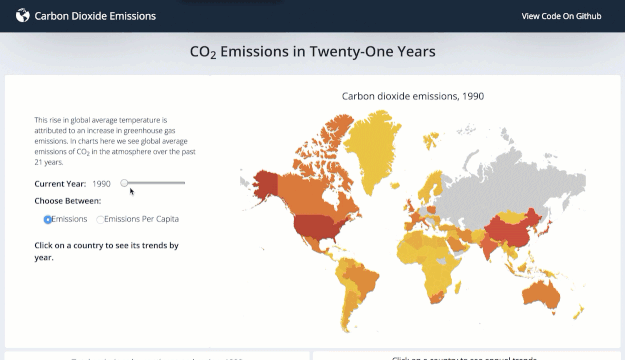
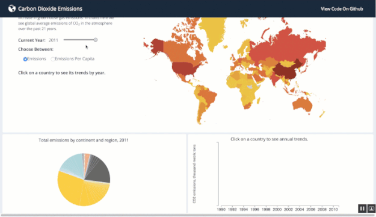

# Carbon Dixocide Emissions - Data Visualization

With the use of D3.js, this [DEMO](https://determined-lichterman-22a68b.netlify.com/) visualizes how CO2 emissions by country has changed in 21 years and also shows the inequality in emissions across the world.

- The map chart visualizes CO2 emissions by country and by year. Users can adjust the year and adjust to represent emissions or emissions per capita.



- The pie chart visualizes the total emissions by continent and region. When users click on a country on the map chart, they can see a breakdown of its emissions by year on the bar chart.



## Development Environment

### Prerequisites

- Node.js & npm: [Click here](https://nodejs.org/en/) to navigate to the Node.js homepage. Follow instructions to install `Node.js` and `npm`.

### Intall


1. Install React

```
$ npm install --save react
```

2. Install D3.js

```
$ npm install d3
```

3. Install React Bootstrap

```
$ npm install react-bootstrap bootstrap
```

4. Install topojson

```
$ npm install topojson
```

### Run

- Run Locally

```
$ npm start
```
